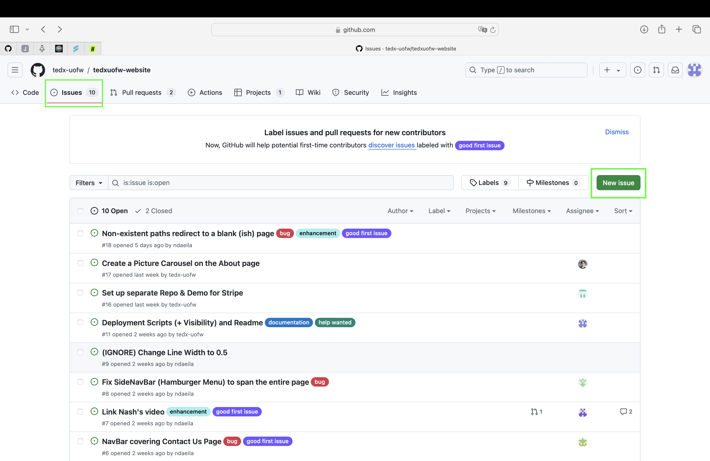
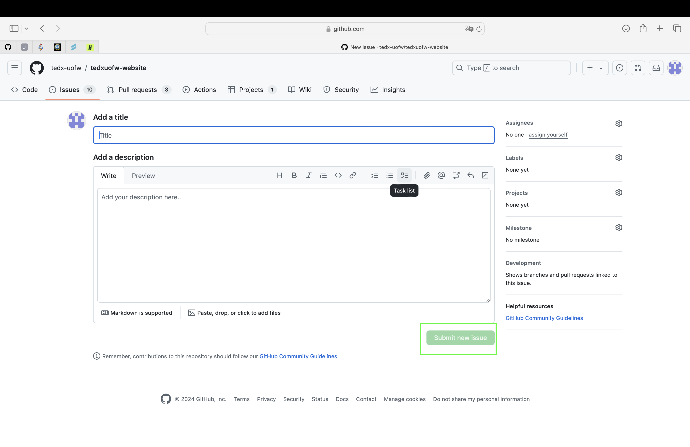
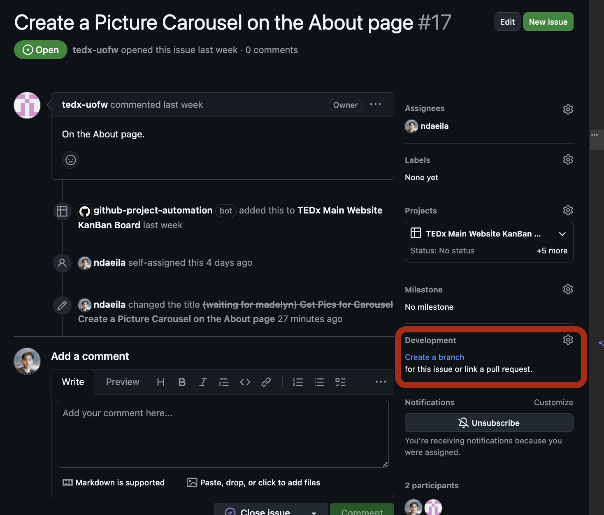
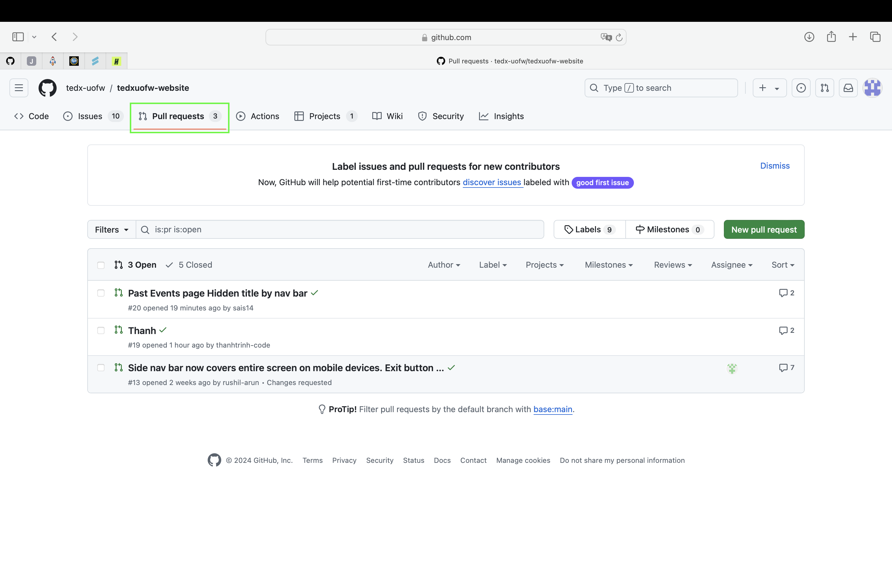
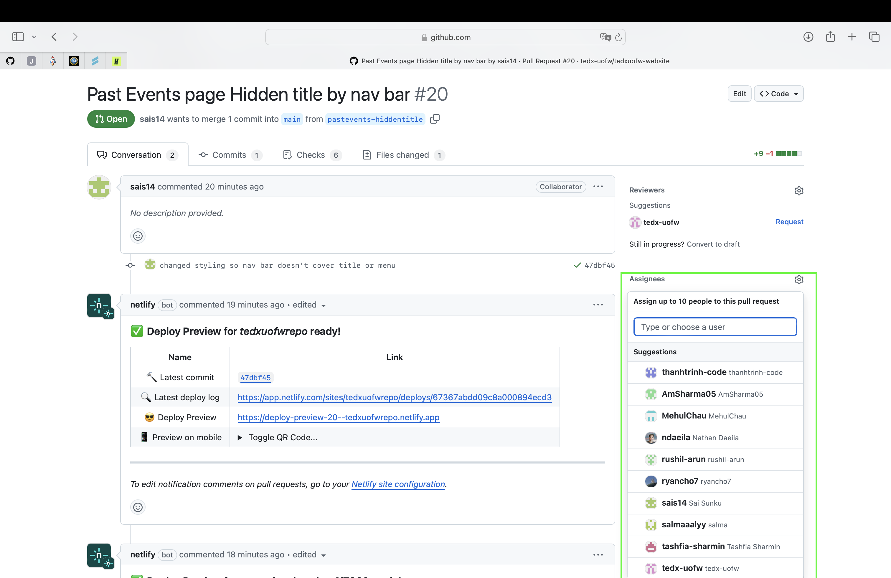

# TEDxUofW Main Website

## Available Scripts
TEDxUofW is a student-run club at the University of Washington in Seattle, Washington. Each year, our dedicated club members organize an annual event that brings professionals from various industries to the university to share their stories, insights, and expertise. This is the GitHub 

## Table of Contents
- [Technologies](#technologies)
- [Deploy the Website](#deploy-the-website)
- [Run the Project Locally](#run-the-project-locally)
- [Make Changes to the Project](#make-changes-to-the-project)

## Technologies

- **Tech Stack**: React, HTML, CSS, Firebase, and Bootstrap

## Deploy the Website

1. **Log in to Netlify**: Access your Netlify account.
2. **Navigate to the Netlify Dashboard**: Once logged in, go to your dashboard.
3. **Add a New Site**: Click on "Add New Site". If you haven't deployed a website on Netlify before, click "Import from Git".
4. **Connect to the GitHub Repository**: Link your GitHub repository to Netlify.
5. **Select the Main Branch**: Choose the main branch for deployment.
6. **Enable Automatic Deploys**: Ensure that automatic deploys are enabled for the **main** branch. This will automatically push changes to the deployment site when the main branch is updated.

## Run the Project Locally

1. **Clone the Repository**:
   ```bash
   git clone https://github.com/tedx-uofw/tedxuofw-website.git
   ```

2. **Download All Modules**:
   ```bash
   cd tedx-uofw
   npm install
   ```

3. **Start the Project**:
   ```bash
   npm run start
   ```

## Make Changes to the Project

1. **Create an Issue in GitHub**:
   - Navigate to the **Issues** tab in your GitHub repository.
   - Click on **New Issue**.

     

   - Provide a **descriptive title** for the issue (be as specific as possible).
   - Add relevant details in the description (steps to reproduce, context, expected behavior, etc.).
   - Click **Submit New Issue** to create the issue.

     

2. **Create a Branch for the Issue**:
   - Use the link within the issue on the right panel under Development that says "Create a branch" for this issue. Develop within that branch until ready to make a PR.
   - On GitHub:

     

   - In your code editor:
     - Navigate to the `tedxuofw-website` directory.
     - Switch to the branch you created:
       ```bash
       git checkout <branch-name>
       ```
   - Make your code changes.
   - Commit the changes:
     ```bash
     git add .
     git commit -m "Description of changes"
     git status
     ```
     - Ensure you are on the correct branch.
     ```bash
     git push
     ```

3. **Create a Pull Request (PR)**:
   - Once the changes are pushed to the branch, go to the **Branches** section in GitHub.
   - Click on **New Pull Request**.

     

   - Select the branch you created and compare it with the **main** branch.
   - Add **2 reviewers** for approval.

     

   - Click **Create Pull Request** to submit the PR.

4. **Update Your Branch if Needed**:
   - If changes to the **main** branch have occurred before completing your PR, update your current branch:
     ```bash
     git pull origin main
     ```
   - Resolve any conflicts that arise and push the merge:
     ```bash
     git push
     ```
   - If someone requests changes, address them and push the updates. Request re-approval.
   - Once you receive 2 approvals and your branch is up-to-date with **main**, merge the pull request with **main**.

5. **Sync Your Branch with Main if Needed**:
   - If the **main** branch has been updated before your PR is complete, update your branch:
     ```bash
     git pull origin main
     ```
   - Resolve any conflicts that arise and push the merge:
     ```bash
     git push
     ```